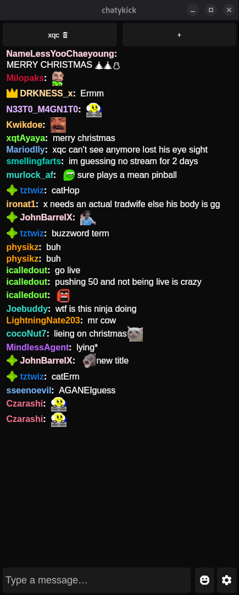
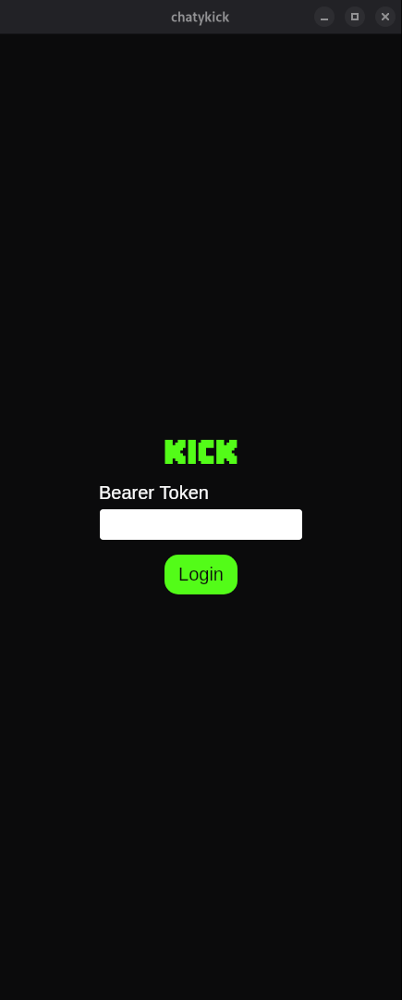

# ChatyKick
A simple desktop application for Kick chat with cool features

# how to get Bearer token ?
### 1. use this extension :
[Extension](https://github.com/titoinemb/GetKickBearerToken-extension/releases)
### 2. copy past this code in your console javascript in kick.com
```js
console.log(decodeURIComponent(document.cookie.split('; ').find(r=>r.startsWith('session_token=')).split('=')[1]))
```

# Images
<p align="left">
  
  
</p>

# utils links
- [kick api](https://github.com/titoinemb/self-kick-api/tree/main)

# attributions
<a href="https://freesound.org/people/yfjesse/sounds/235911/">Notification Sound</a> by <a href="https://freesound.org/people/yfjesse/">yfjesse</a> | License: <a href="http://creativecommons.org/publicdomain/zero/1.0/">Creative Commons 0</a>